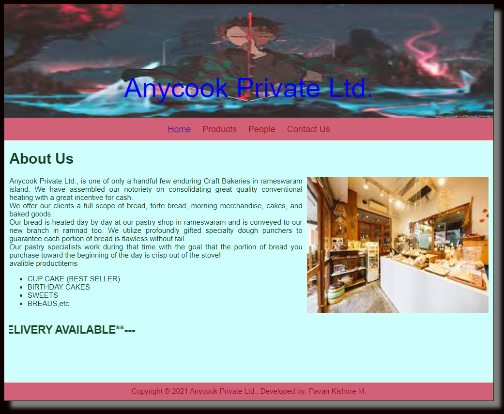
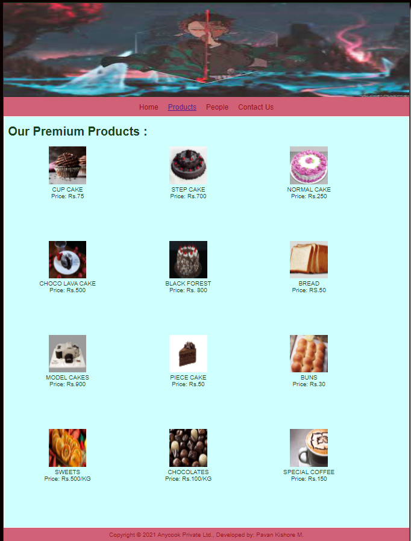
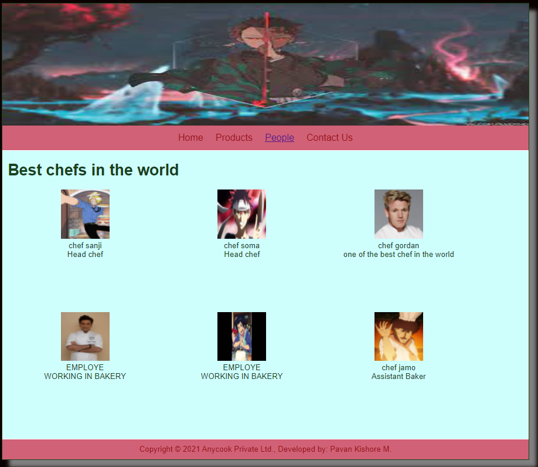
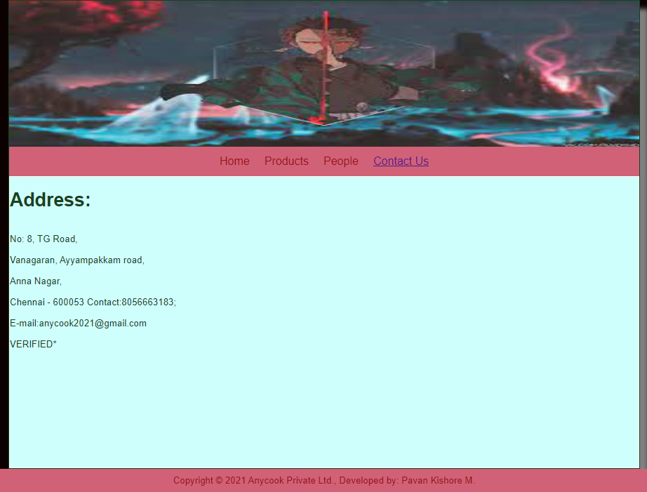

# Web Design for a Software Product Company

## AIM:

To design a static website for a software product company company.

## DESIGN STEPS:

### Step 1:

Requirement collection.

### Step 2:

Creating the layout using HTML and CSS.

### Step 3:

Updating the sample content.

### Step 4:

Choose the appropriate style and color scheme.

### Step 5:

Validate the layout in various browsers.

### Step 6:

Validate the HTML code.

### Step 6:

Publish the website in the given URL.

## PROGRAM :

### Layout:

### Home Page:
~~~
<!DOCTYPE html>
<html lang="en">
  <head>
    <title>Anyproduct Private limited.</title>
    <link rel="stylesheet" href="./css/layout.css" />
    <link rel="icon" href="./img/icon.png" type="image/x-icon" />
  </head>

  <body>
    

      
Anyproduct Private limited.

      

        
<a href="/static/home.html">Home</a>

        
<a href="/static/products.html">Products</a>

        
<a href="/static/people.html">People</a>

        
<a href="/static/contactus.html">Contact Us</a>

      

      

        

          <h1>About Us</h1>
          
          

            Dynamic software offers a full collection of tools for animating and
            designing characters,
             
            as well as a library of various brushes that
            can
            designing characters, as well as a library of various brushes that can
           be further expanded with third-party brushes. It should also be noted
           that you can get Dynamic Animate free to study the basic functions or
           you
           can choose an alternative program.Dynamic software allows you to breathe life into your characters, design
           animated
            sketches and avatars, and make your eLearning and infographic projects
           more dynamic
            and engaging. After you've finished your work, simply click the publish
           button to share
            it on a plethora of platforms in your preferred format to reach as big
           of an audience as possible.
           
            <ul>
              <li>Quality file compression.</li>
              <li>Allows creating animated elements.</li>
              <li>Cross-functionality.</li>
              <li>Can be integrated with other Dyno software.</li>
              <li>Lots of learning materials.</li>
              <li>Can be integrated with Photoshop and Illustrator.</li>
              <li>Automatic limb animations.</li>
              <li>Recording and editing takes.</li>
              <li>You need a webcam and microphone to use.</li>
              <li>Highly functional.</li>
              <li>Suitable for all types of animation.</li>
              <li>Has tutorials.</li>
              <li>Can be hard for beginners.</li>
          
          </ul>
        

      

    

    

      Copyright &#169; Anyproduct Private limited., Developed by M.pavan kishore.
    

  

</body>
</html>
~~~
### Products:
~~~
<!DOCTYPE html>
<html lang="en">
  <head>
    <title>Anyproduct Private limited.</title>
    <link rel="stylesheet" href="./css/layout.css" />
    <link rel="icon" href="./img/icon.png" type="image/x-icon" />
  </head>

  <body>
    

      
Anyproduct Private limited. 

      

        
<a href="/static/home.html">Home</a>

        

          <a href="/static/products.html">Products</a>
        

        
<a>People</a>

        
<a>Contact Us</a>

      

      

        
    
          <h1>Our Premium Products</h1>
          

              
 
                  

                  
                  

                  
 any photoshop

                  
Price: Rs.2000/year 

              

         
 
                  

                  
                  

                  
 any photoshop premium

                  
Price: Rs.10,000/year 

              

              
 
                

                
                

                
 any Animate

                
Price: Rs.1,000/year 

            

            
 
                

                
                

                
 any Animate premium

                
Price: Rs.5000/year

            

            
 
                

                
                

                
 any Lightroom

                
Price: Rs.4000

            

            
 
                

                
                

                
 any lightroom premium

                
Price: Rs.8000/year 

            

            
 
                

                
                

                
 any sketch

                
Price: Rs.200/year 

            

            
 
                

                
                

                
 any sketch premium

                
Price: Rs.500/year 

            

            
 
                

                
                

                
 any video editor

                
Price: Rs.4000/year 

            

            
 
                

                
                

                
 any  video editor premium

                
Price: Rs.10,000/year 

            

            
 
                

                
                

                
 any logo creator

                
Price: Rs.100/year 

            

            
 
                

                
                

                
 any logo creator premium

                
Price: Rs.400/year 

            

          

          
          
        
      

      

        Copyright &#169;Anyproduct Private limited., Developed by M.Pavan kishore.
      

    

  </body>
</html> 
~~~
### People:
~~~
<!DOCTYPE html>
<html>
    <head>
        <title>Anyproduct Private limited.</title>
        <link rel="stylesheet" href="./css/layout.css" />       
         <link rel="icon" href="./img/icon.png" type="image/x-icon" />
    </head>
    <body>
            
Anyproduct Private limited.
 
            

                
<a href="./home.html">Home</a>

                
<a href="./products.html">Products</a>

                
<a href="./people.html">People</a>

                
<a href="./contact.html">Contact Us</a>
                

             

         

         

            
    
                <h1><b><u>The Diamonds of Our Company</u><b></h1>
                

                    
 
                        

                        
                        

                        
CEO

                        
Mr.Jack 

                    

                    
 
                        

                        
                        

                        
Product Manager

                        
Mr.Suchin 

                    

                    
 
                        

                        
                        

                        
VP of Marketing

                        
Mr. Jones

                    

                    
 
                        

                        
                        

                        
Project Manager

                        
Mr.Ryan 

                    

                    
 
                        

                        
                        

                        
Technical Lead

                        
Mr. Fed

                    

                    
 
                        

                        
                        

                        
Senior Engineer

                        
Mr. Ruther 

                    

                    
                

                
        
            

        

            Copyright &#169;Anyproduct Private limited.,Developed by M.Pavan kishore.
          

        

      </body>
    </html>
    
    </body>

</html>

~~~
### Contact Us:
~~~
<!DOCTYPE html>
<html>
    <head>
        <title>Anyproduct Private limited.</title>
        <link rel="stylesheet" type="text/css" href="css/layout.css">
        <link rel="icon" type="image/x-icon" href="/static/images/favicon.ico">
    </head>
    <body>
        

            
Anyproduct Private limited.
 
            

             
<a href="/static/home.html">Home</a>

             
<a href="/static/products.html">Products</a>

             
<a href="/static/people.html">People</a>

             
<a href="/static/contacts.html">Contact Us</a>
             

         

        

            

                <h1><b><u>contact us</u></b></h1>
                
<h4>Mail us at anyproduct@gmail.com</h4>

                
<h4>Call us at 9848689024</h4>

                
<h4>Our Main Branch is at:- 3-199 parkavenue line, opposite to clock tower, Sas building 5th floor</h4>

                

            

        

        

            Copyright &#169;Anyproduct Private limited., Developed by M.Pavan kishore.
          

        

      </body>
    </html>
    
    </body>

</html>
~~~
## OUTPUT:

### Home Page:

### Products:

### Peoples:

### Contact Us:

## Result:

Thus a website is designed for the software product company and the HTML,CSS code are validated.
